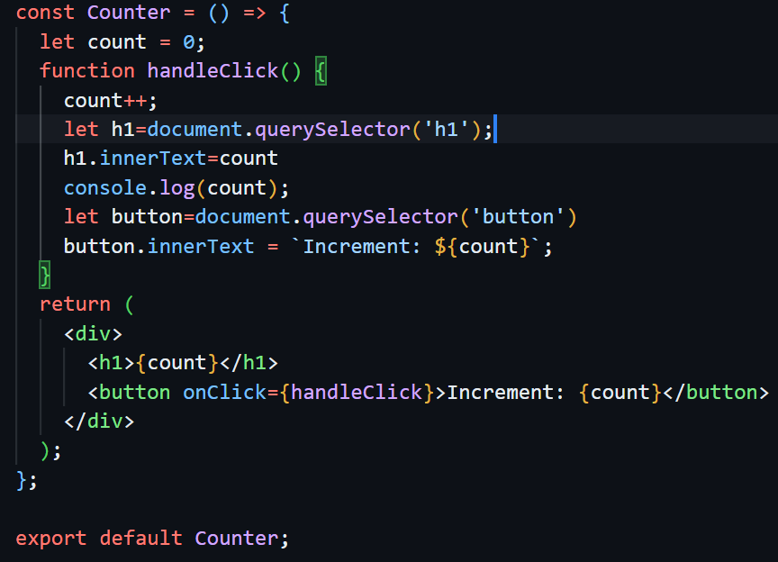
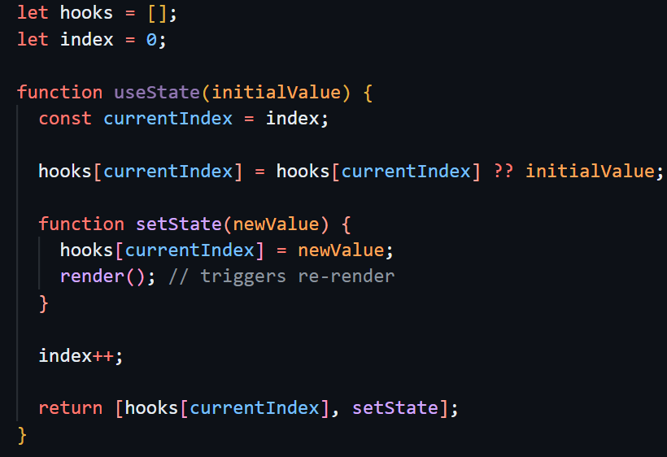
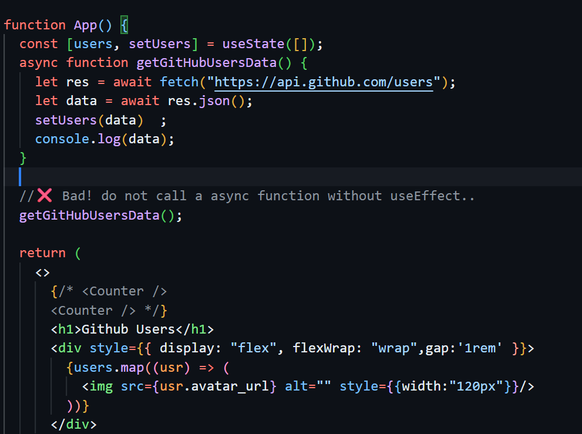
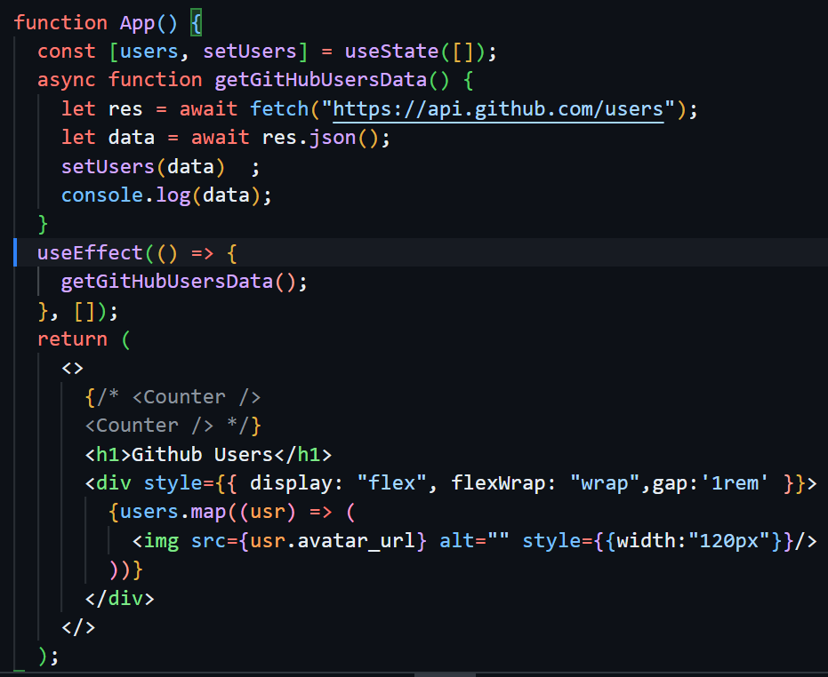

# 📘 React Learning — Day 04

## Deep dive into useState, useEffect hooks

This document explains the **useState and useEffect hook** in detail, including  
what it is, why it is used, how it works, and behind-the-scenes working.

## 📌 What is useState?

`useState` is a **React Hook** that allows functional components to store and manage **state (data)**.
It returns:

- The **current state value**
- A **function to update that state**

### Syntax:

<!-- ```js -->

const [state, setState] = useState(initialValue);

---

## ❓ Why is useState used?

In React, UI depends on data.
When data changes, the UI should automatically update.

`useState` is used because:

- Normal variables do not trigger UI updates
- State changes cause re-rendering
- It helps manage dynamic data like:
- Counters
- Form inputs
- Toggles
- API responses

---

## why we need useState hook?

**reason-1**
If we do not use useState, we have to do lots of DOM manuplation, we can see that in this image , we had to first select `h1` and `button` and then changes its content. In this case, we are using `count` variable only at two place, if we want to use it multiple places,for this purpose we will have to first access the element then we change it's content.


**reason-2**
`React` says that it is responsiblity of itself to interact with `DOM`,because `React` can manage `DOM interaction` better and effecient..

**reason-3**
Without `useState` if we use a component multiple times in our project, the state of each component can to be managed.

---

## ⚙️ How does useState work?

- useState initializes a state value
- React stores this value internally
- When setState is called:
  State value updates
  Component re-renders
  UI updates automatically

Example:
import { useState } from "react";

function Counter() {
const [count, setCount] = useState(0);

return (
<button onClick={() => setCount(count + 1)}>
Count: {count}
</button>
);
}

---

## 🧠 Behind the Scenes: How useState Works Internally

React internally manages state using:

- An array
- A hook index



---

## ⚠️Important Rules of useState

Hooks must be called at the top level
Do not use hooks inside:

- Loops
- Conditions
- Nested functions
  Never update state directly:
  `count = count + 1` ❌

_Correct_:
`setCount(count + 1)` ✅

---

## 🔥 Functional Update (Best Practice)

When new state depends on previous state:

`setCount(prevCount => prevCount + 1);`

### What is useEffect?

`useEffect` is a React Hook that lets you perform **side effects** in your functional components.

**Side effects** are operations that affect things outside your component:

- Fetching data from APIs
- Setting up timers (setInterval, setTimeout)
- Subscribing to external services
- Manually updating the DOM
- Adding event listeners

### Why Do We Need useEffect?

**React components are functions that:**

1. Run
2. Return JSX
3. React updates the screen

This happens **synchronously** - React needs JSX immediately.
**Problem:** What if you need to do something that takes time (like fetching data)?
You can't pause the component function and wait!
**Solution:** useEffect runs your code **AFTER** the component renders.

## 2. The Problem useEffect Solves

### React's Rendering Model

```
Component function runs → Returns JSX → React updates screen

```

This is **synchronous** and **fast**.

## What Happens Without useEffect?

Fetching data without useEffect:

**Problem:** Fetching data without useEffect make the website slow because it renders the coponent again and again. In simple words, we can say it creat infinite loop of rendering the same component.
what happening:

1. Component renders → fetch runs
2. fetch complete → setUsers called
3. State changes → Component re-renders
4. Component renders → fetch runs AGAIN
5. Fetch completes → setData called
6. State changes → Component re-renders
7. Infinite loop! 🔁💥
   `That's why we use useEffect for side works.`

## Syntax and Structure

import { useEffect } from 'react';

useEffect(() => {
// 1. Effect function - Your side effect code here

return () => {
// 2. Cleanup function (optional) - Clean up code here
};
}, [dependencies]); // 3. Dependency array - Controls when effect runs

**Three parts:**

1. **Effect Function** - The code you want to run
2. **Cleanup Function** (optional) - Code to clean up (returned from effect)
3. **Dependency Array** - Tells React when to run the effect, we can provide the `dependency state`, when we want that `useEffect run` when the `given state changes`.

### When Does useEffect Run?

**Timeline:**

```
1. Component renders (JSX returned)
2. Screen updates (user sees changes)
3. THEN useEffect runs (after everything)
```

## Using fetch with useEffect

The Correct Way to Fetch Data:


**What happens:**

First Render:
1. Component renders 
2. jsx parts renders
3. In the useEffect run
4. fetched the data → set the data to setUsers(data)
5. component re-renders
6. useEffect sees [] → "Already ran, skip"
7. Screen shows the data
8. Done! ✅

The empty array `[]` is KEY - it prevents the infinite loop!,because it indicates the useEffect will run only once at loading time.

## Understanding Cleanup Functions
A cleanup function is what you return from the effect function.

### When Does Cleanup Run?
** scenarios:**

1. **Before effect runs again** (when dependencies change)
2. **When component unmounts** (removed from screen)
**Example:** 
**When we use timing functions (setInterval,setTimeOut)** (because we want that whenever dependency change the old function must clean out,if we do not do it,it will create multiple timing functions)

