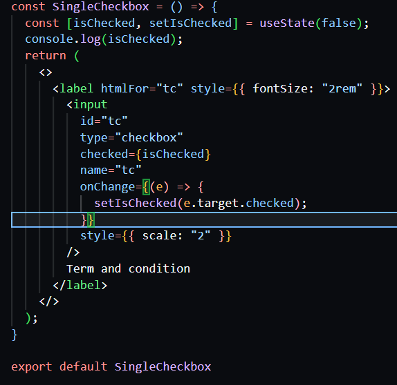

# 📘 React Learning — Day 09

# Form Handling in React (**Part-2**)

> **Day Focus:** Input type `checkbox` (**Production level**)

# ✅ Checkbox Handling in React (Production-Level Notes)

These notes document my **learning journey and implementation approach** for handling checkboxes in React —> starting from basic usage to **clean, scalable, production-level patterns**.

---

## 📌 Why Checkbox Handling Matters

Checkboxes look simple but become tricky when:

* Multiple options are involved
* State management grows
* Features like **Select All / Deselect All** are required
* UI needs to be dynamic and scalable

That’s why understanding the **right patterns** is important for real-world React applications.

---

## 1️⃣ Single Checkbox Handling (Basic)

### 🎯 Goal

Handle a single checkbox (e.g., Terms & Conditions).

### 🔑 Key Learning

* Checkbox works with **checked (true / false)**, not value
* It should always be a **controlled component**

### 🧠 Approach

* Created a boolean state
* Bound it to `checked`
* Updated state using `e.target.checked`

This helped me clearly understand how checkbox state flows in React.

---

## 2️⃣ Multiple Checkboxes (Initial Approach – Not Optimal)

### 🎯 Goal

Allow users to select multiple options (e.g., languages).

### ❌ Initial Implementation

* Used **multiple `useState` hooks**
* Used **separate handlers** for each checkbox

### ⚠️ Problem

* Code became repetitive
* Not scalable
* Hard to manage when options increase

This made me realize that **this approach is not production-friendly**.

---

## 3️⃣ Optimized Approach: Single State + Single Handler ✅

### 🎯 Improvement Goal

Handle multiple checkboxes efficiently using a single object-based state.

🔑 Key Decisions
* Used one object state to manage form-related data
* Stored checkbox selections as an array inside the object
* Used one common handler for all inputs

### 🧠 Logic Used

* Maintained a form object (e.g., languages)
* Checkbox field updated based on checked state

### 💡 Why Object State?

* Matches real-world form structures
* Easy to send data to backend APIs
* Keeps all form data in one place
 ~This approach:~
* Reduced code duplication
* Improved readability
* Became scalable for large production forms

---

## 4️⃣ Select All / Deselect All Feature 🔥

### 🎯 Goal

Add a **Select All** checkbox to control all options.

### 🧠 Implementation Logic

* If Select All is checked → select all options
* If unchecked → clear all selections
* Sync Select All checkbox based on selected items status

### 💡 Learning Outcome

This feature taught me:

* How derived state works
* How one checkbox can control many others
* How production apps handle bulk actions

---

## 5️⃣ Avoiding Repetition: Dynamic Rendering Using `map()`

### 🎯 Problem

Manually writing checkbox JSX again and again was inefficient.

### ✅ Solution

* Stored checkbox options in an array
* Rendered checkboxes dynamically using `map()`

### 🌟 Benefits

* Cleaner UI code
* Easy to add/remove options
* Matches **real-world production patterns**

This is how checkboxes are rendered in most professional React apps.

---

## 6️⃣ Final Production-Level Pattern Followed

### ✅ Best Practices Applied

* Controlled components only
* Single state for related inputs
* Single change handler
* Dynamic UI rendering
* Scalable and maintainable logic

### 🏆 Result

I can now confidently handle:

* Single checkbox
* Multiple checkboxes
* Select All / Deselect All
* Dynamic checkbox lists

All using **clean and production-ready React code**.

---

## 🚀 Key Takeaways

* Checkbox = `checked`, not `value`
* Multiple checkboxes should use **array or object state**
* Avoid multiple states and handlers
* Always think about scalability
* Map-based UI rendering is a must for production

---

## 📁 Usage of This Notes File

This `notes.md` file:

* Documents my learning process
* Explains *how and why* I implemented each step

---

✅ **Checkbox handling is now clear, optimized, and production-ready.**
